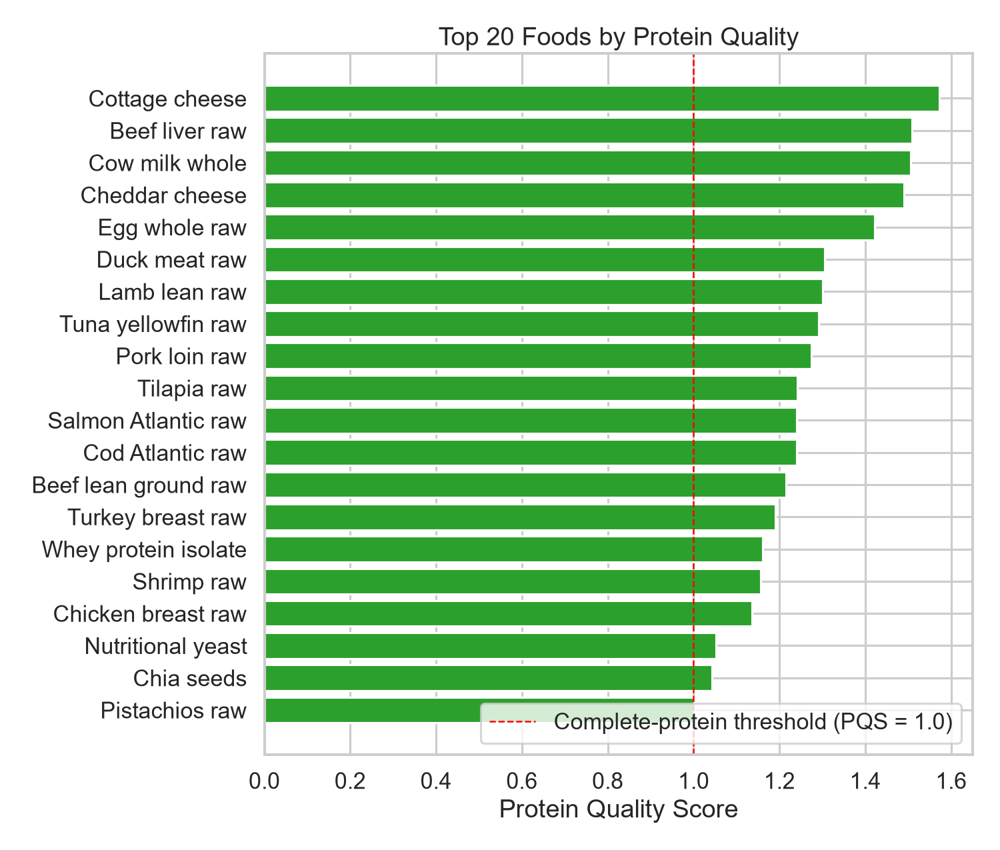

# Predicting Protein Quality Using Amino Acid Profiles

This was my course project for a data management class. It loads foods and their amino acid values into a small SQLite database, gives each food a protein quality score, and trains two classifiers to predict if a food counts as a complete protein.



## How the score works

Each food's essential amino acids are expressed per gram of protein and compared with a reference requirement pattern.

```text
AAS = amino acid amount per gram of protein / reference requirement
PQS = digestibility factor * lowest AAS among the essential amino acids
```

A PQS of 1.0 or more is treated as a complete protein. Below 1.0, at least one essential amino acid falls short.

## Run

```bash
python -m venv .venv
.venv\Scripts\activate          # Mac/Linux: source .venv/bin/activate
pip install -r requirements.txt
python scripts/run_pipeline.py
pytest tests/
```

The pipeline writes a ranking, the model metrics and the figures to `results/`. The data is `data/sample/foods_sample.csv`, 61 foods with values from USDA FoodData Central, stored in SQLite (schema in `sql/schema.sql`). The code is in `src/`, and the score itself is `src/scoring.py`, under 60 lines.

Built with pandas, NumPy, scikit-learn, SQLAlchemy, matplotlib and seaborn.

## Results

On the 61-food sample, 20 foods score as complete proteins. The top five are cottage cheese (1.572), beef liver (1.509), whole cow milk (1.506), cheddar cheese (1.490) and whole egg (1.422).

Classifier results, from 5-fold cross-validation on all 61 foods and a separate 80/20 split with 13 test foods:

| Model | CV accuracy | CV F1 | Test accuracy | Test F1 |
|---|---|---|---|---|
| Logistic Regression | 0.935 +/- 0.033 | 0.898 | 0.923 | 0.857 |
| Random Forest | 0.950 +/- 0.067 | 0.921 | 0.923 | 0.889 |

With 13 test foods, one wrong prediction moves accuracy by about 8 points, so the two models aren't really different.

## Limitations

- The "complete protein" label is made by a rule (PQS >= 1.0), and PQS is computed from the same amino acid values the classifiers train on. So the models show how well a known rule can be recovered, not a discovery about nutrition.
- The sample is small (61 foods), so the numbers above would likely change with more data.
- Missing amino acid values are filled with 0, and the reference pattern and digestibility factors are constants in `src/config.py`. The score is a classroom approximation, not a validated nutritional measure.
